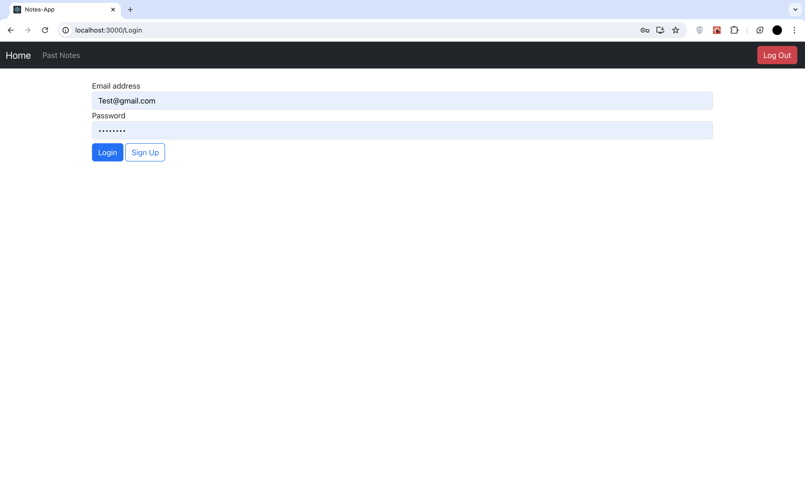
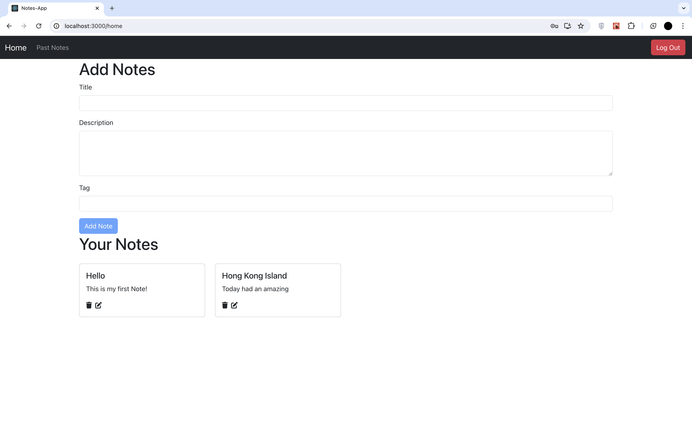

# Overview
&nbsp;
&nbsp;

This notes app allows you to write notes in a personalised space on the web.

## Getting Started
In the project directory, install node modules via:

### `mongod`
Start your mongodb server first at port 27017.

### `nodemon`
Start listing at port 5000 via express.

- cd backend
- Run: ./node_modules/.bin/nodemon ./index.js

### `npm install`

Runs the app in the development mode via:

### `npm start`

Open [http://localhost:3000](http://localhost:3000) to view it in your browser.
